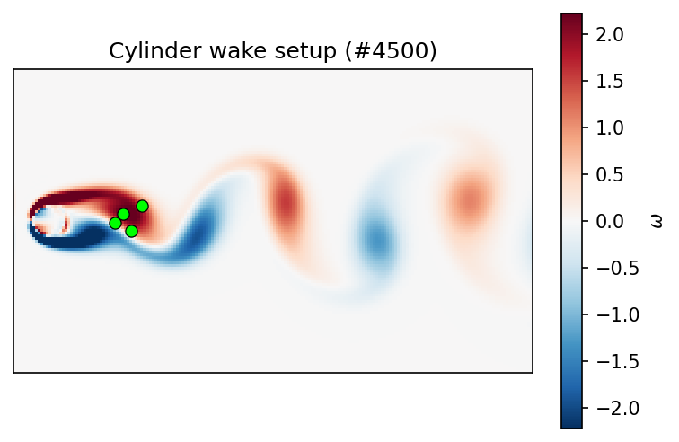
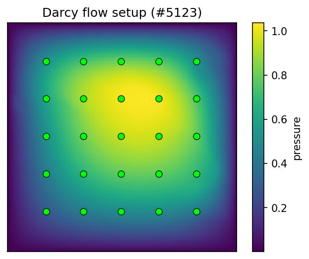
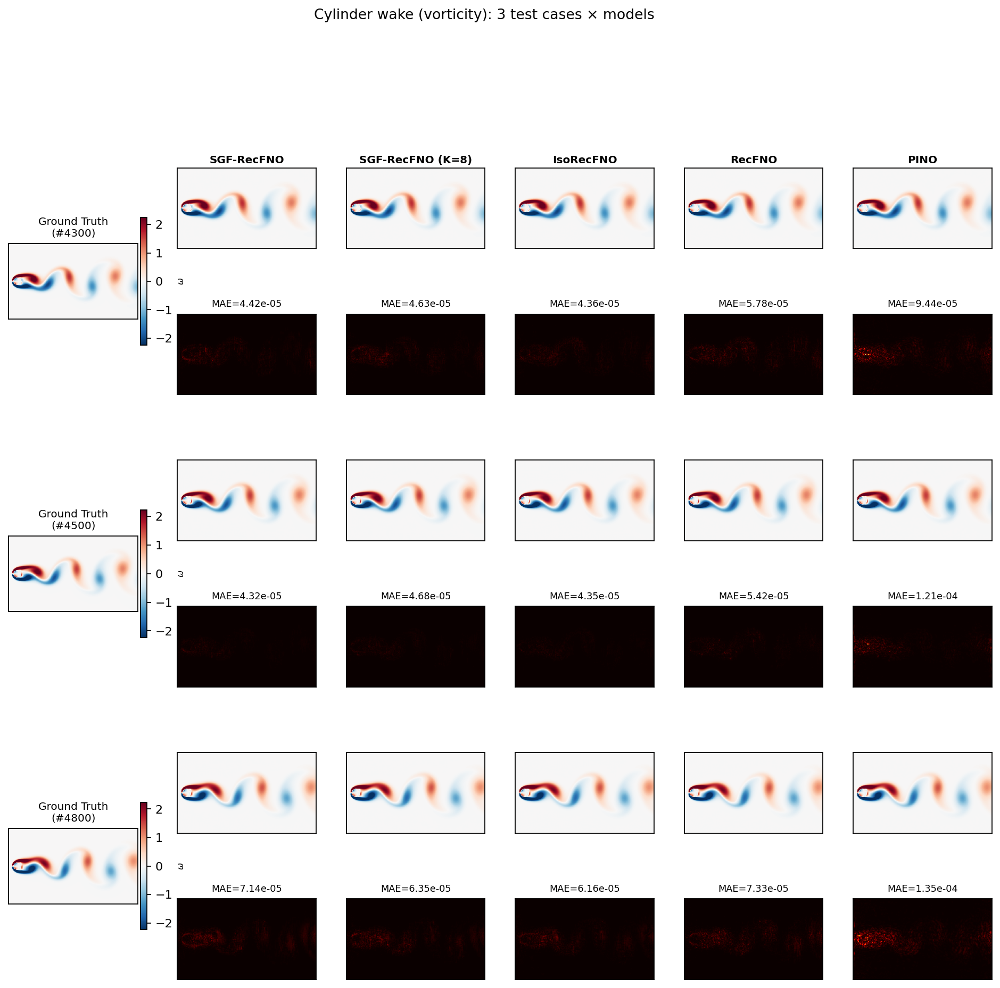
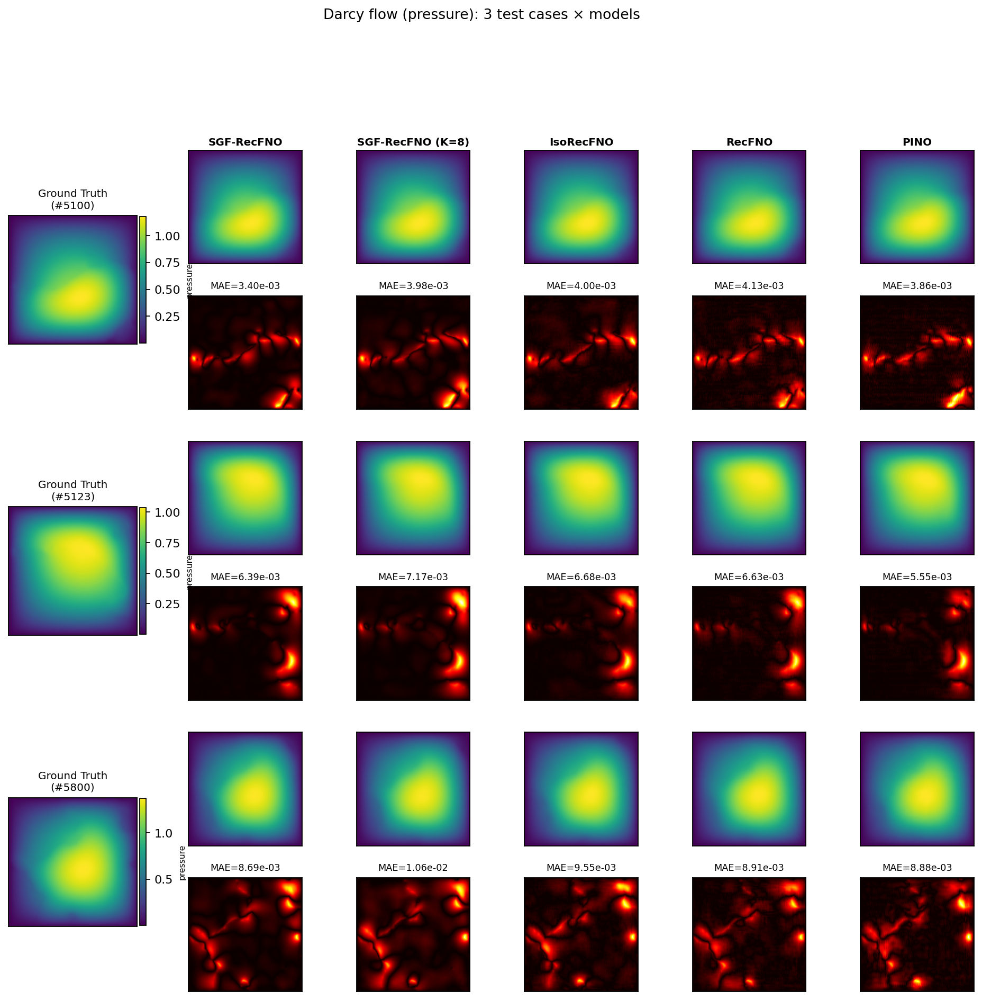
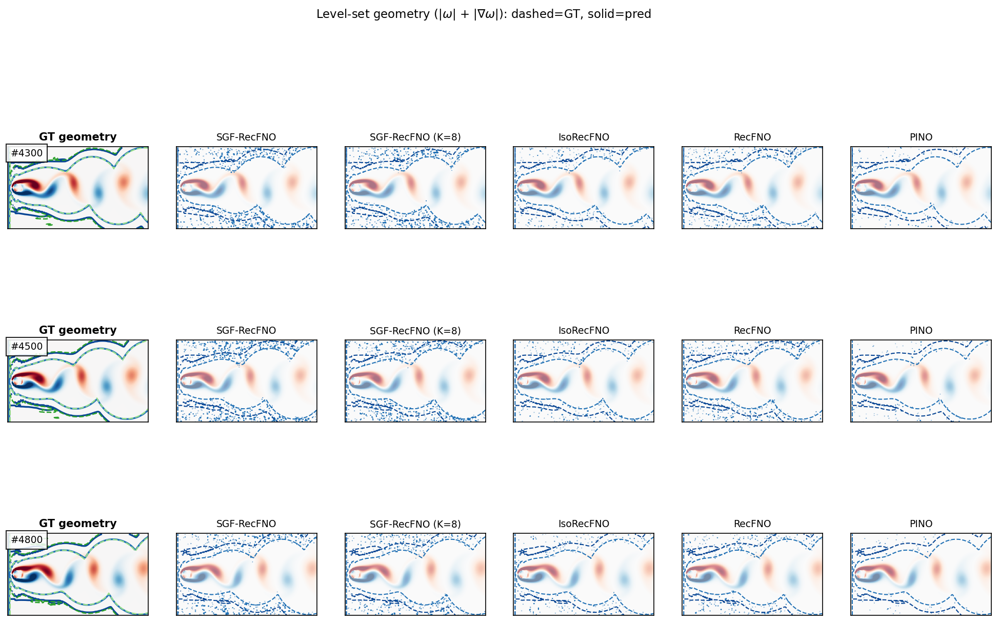
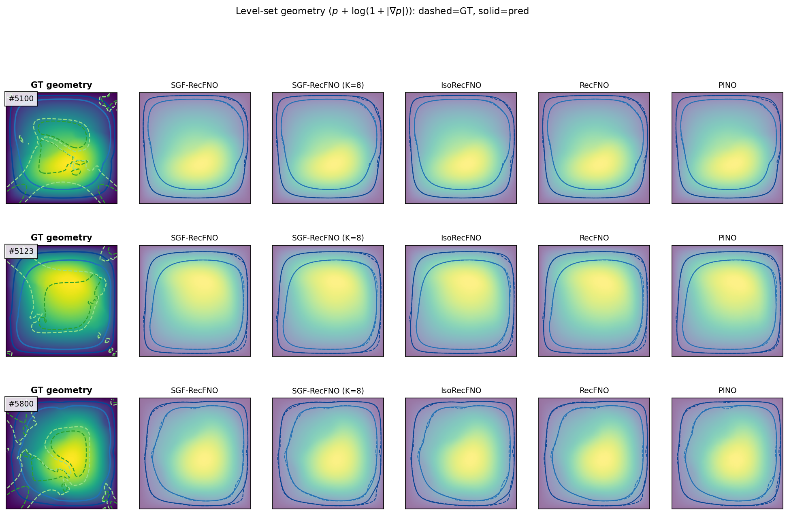
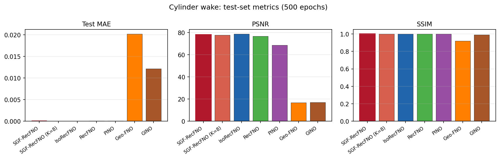
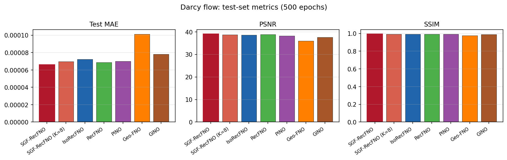
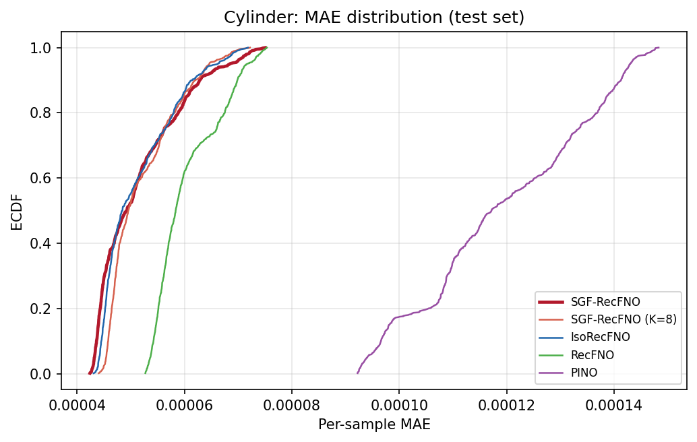
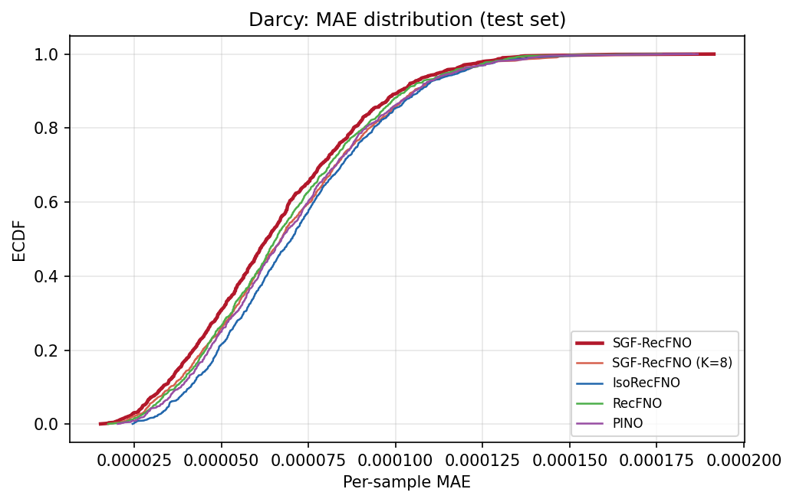

# SGF-RecFNO

**Self-Geometry Feedback RecFNO** — operator learning for heat field reconstruction from sparse observations.

> This repository extends [RecFNO](https://github.com/zhaoxiaoyu1995/RecFNO) (Zhao et al., 2023). The **primary contributions** by **Yinbao Li** are **IsoRecFNO** and **SGF-RecFNO**. **SGF-RecFNO** is the recommended method.

[](https://github.com/Yinbao-Li/SGF-RecFNO)

## Architecture

### SGF-RecFNO — self-geometry feedback

Sparse sensors → FNO backbone → predicted temperature field → multi-level isotherm SDFs → lightweight Fourier refinement (closed-loop geometry feedback).

[](figures/method/pipeline_sgf.pdf)

### IsoRecFNO — isotherm-aware geometry branch

Joint field reconstruction with explicit isotherm supervision on a geometry-aware branch.

[](figures/method/pipeline_isorecfno.pdf)

---

## Methods

| Method | Source | Description |
|--------|--------|-------------|
| **SGF-RecFNO** | **Yinbao Li (this repo)** | Self-geometry feedback: multi-level isotherm SDFs from the predicted field, refined via a lightweight Fourier block |
| **IsoRecFNO** | **Yinbao Li (this repo)** | Geometry-aware branch with joint isotherm supervision |
| RecFNO | Zhao et al. (2023) | Original FNO reconstruction baseline |
| PINO / Geo-FNO / GINO | Third-party baselines | Official implementations for comparison |

Implementation: `model/sgf_recfno.py` · Loss: `utils/sgf_loss.py`

---

## Benchmark results (test 5000–5999, n=1000)

| Model | Test MAE ↓ | Notes |
|-------|-----------|-------|
| **SGF-RecFNO** | **0.00346 K** | **Best — pre-trained weights included** |
| PINO | 0.00351 K | Pre-trained |
| IsoRecFNO | 0.00512 K | Pre-trained |
| RecFNO | 0.00727 K | Pre-trained |
| Geo-FNO | 0.0373 K | Pre-trained |
| GINO | 0.3658 K | Pre-trained |

### Problem setup

25 sensors on a 200×200 field; Dirichlet / adiabatic boundaries.

### Six-model comparison (3 test cases)


### Isotherm geometry (contours vs. ground truth)


### Test-set metrics & MAE distribution

| Bar charts (MAE, RMSE, PSNR, …) | Per-sample MAE (ECDF + ridge) |
|--------------------------------|-------------------------------|
|  |  |

### Qualitative pipeline & SDF ablation

| Pipeline detail (sample #5500) | Inference-time SDF ablation |
|--------------------------------|----------------------------|
|  |  |

More figures and regeneration commands: [figures/README.md](figures/README.md).

---

## Fluid benchmark (cylinder wake & Darcy flow, 500 epochs)

Task-specific level-set geometry (see `utils/field_geometry.py`):

| Task | Field | SGF geometry | Test MAE (SGF / RecFNO) |
|------|-------|--------------|-------------------------|
| **Cylinder** | \(\omega\) | \(\|\omega\|\) + \(\|\nabla\omega\|\), wake-weighted loss | **5.1e-5** / 6.0e-5 |
| **Darcy** | \(p\) | \(p\) + \(\log(1+\|\nabla p\|)\) | **6.6e-5** / 6.9e-5 |

### Problem setup

| Cylinder (4 sensors) | Darcy (25 sensors) |
|----------------------|---------------------|
|  |  |

### Three cases × models

| Cylinder wake | Darcy flow |
|---------------|------------|
|  |  |

### Level-set geometry overlay

| Cylinder | Darcy |
|----------|-------|
|  |  |

### Test metrics & MAE distribution

| Cylinder metrics | Darcy metrics |
|------------------|---------------|
|  |  |
|  |  |

```bash
export RECFNO_DATA_ROOT=../../data
make train-fluid-resume      # train / resume to 500 ep
make compare-fluid           # per-task evaluation JSON
make plot-fluid-figures      # regenerate figures above
```

Data: [data/fluid/README.md](../data/fluid/README.md)

---

## Quick start

### 1. Clone (with checkpoints via Git LFS)

```bash
sudo apt install git-lfs    # once per machine
git lfs install
git clone https://github.com/Yinbao-Li/SGF-RecFNO.git
cd SGF-RecFNO
git lfs pull
```

Verify weights downloaded (each `.pth` should be **MB**, not ~130 bytes):

```bash
ls -lh checkpoints/*/*.pth
```

### 2. Install

```bash
python -m venv .venv && source .venv/bin/activate
pip install -e .
```

### 3. Data

**Option A — bundled splits (after `git lfs pull`):**

```bash
ls data/heat/train.h5 data/heat/val.h5 data/heat/test.h5
```

**Option B — download or generate:**

```bash
python scripts/generate_temperature6000.py
# or download from SharePoint (see data/heat/README.md)
```

See [data/heat/README.md](data/heat/README.md) for split indices (train 0–3999, val 4000–4999, test 5000–5999).

### 4. Evaluate pre-trained models (no training required)

```bash
make compare
make plot-case
make plot-figures    # regenerate README figures (needs GPU + data)
```

### 5. Train from scratch

```bash
make train-sgf        # SGF-RecFNO only
make train-all        # SGF-RecFNO + IsoRecFNO + RecFNO
make setup-external && make train-external   # external baselines
make train-ablations  # loss & SDF-depth ablations (9×300 ep)
```

---

## Repository layout

```
SGF-RecFNO/
├── checkpoints/           ← pre-trained weights (Git LFS)
├── figures/               ← README figures (heat + fluid + method)
├── model/                 ← SGF-RecFNO, IsoRecFNO, RecFNO
├── data/                  ← HeatDataset + fluid loaders
├── benchmark/             ← evaluation, heat/fluid plotting
├── heat2D/                ← heat training & runtime logs
├── fluid2D/               ← fluid training entry points
├── scripts/               ← data generation & setup
└── docs/                  ← structure notes
```

See [docs/STRUCTURE.md](docs/STRUCTURE.md), [benchmark/README.md](benchmark/README.md), and [checkpoints/README.md](checkpoints/README.md).

---

## Citation

See [CITATION.md](CITATION.md). Please cite RecFNO (Zhao et al.) when using the backbone, and credit SGF-RecFNO / IsoRecFNO (Yinbao Li) for the extensions.

Maintainer: **Yinbao Li** · [GitHub](https://github.com/Yinbao-Li)
