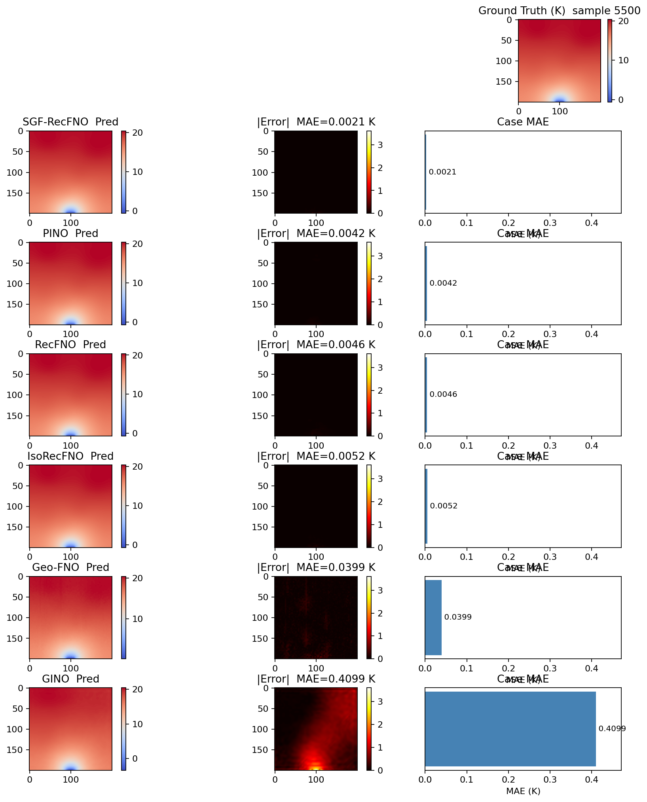

# SGF-RecFNO

**Self-Geometry Feedback RecFNO** — operator learning for heat field reconstruction from sparse observations.

> This repository extends [RecFNO](https://github.com/zhaoxiaoyu1995/RecFNO) (Zhao et al., 2023). The **primary contributions** by **Yinbao Li** are **IsoRecFNO** and **SGF-RecFNO**. **SGF-RecFNO** is the recommended method.

[](https://github.com/Yinbao-Li/SGF-RecFNO)

---

## Methods

| Method | Source | Description |
|--------|--------|-------------|
| **SGF-RecFNO** | **Yinbao Li (this repo)** | Self-geometry feedback: multi-level isotherm SDFs from the predicted field, refined via a lightweight Fourier block |
| **IsoRecFNO** | **Yinbao Li (this repo)** | Geometry-aware branch with joint isotherm supervision |
| RecFNO | Zhao et al. (2023) | Original FNO reconstruction baseline |
| PINO / Geo-FNO / GINO | Third-party baselines | Official implementations for comparison |

Implementation: `model/sgf_recfno.py` · Loss: `utils/sgf_loss.py`

---

## Benchmark results (test 5000–5999)

| Model | Test MAE ↓ | Notes |
|-------|-----------|-------|
| **SGF-RecFNO** | **0.00346 K** | **Best — pre-trained weights included** |
| PINO | 0.00351 K | Pre-trained |
| IsoRecFNO | 0.00512 K | Pre-trained |
| RecFNO | 0.00727 K | Pre-trained |
| Geo-FNO | 0.0373 K | Pre-trained |
| GINO | 0.3658 K | Pre-trained |



---

## Quick start

### 1. Clone (with checkpoints via Git LFS)

```bash
git lfs install
git clone https://github.com/Yinbao-Li/SGF-RecFNO.git
cd SGF-RecFNO
git lfs pull
```

### 2. Install

```bash
python -m venv .venv && source .venv/bin/activate
pip install -e .
```

### 3. Data

Download the [heat dataset](https://nudteducn-my.sharepoint.com/:f:/g/personal/zhaoxiaoyu13_nudt_edu_cn/ElHePUBS_gpIjr240jcrdZ4BhMKsA3DBeYWLS6Roq_52TA?e=RZKOh5) or generate locally:

```bash
python scripts/generate_temperature6000.py
```

### 4. Evaluate pre-trained models (no training required)

```bash
make compare
make plot-case
```

### 5. Train from scratch

```bash
make train-sgf     # SGF-RecFNO only
make train-all     # SGF-RecFNO + IsoRecFNO + RecFNO
make setup-external && make train-external   # external baselines
```

---

## Repository layout

```
SGF-RecFNO/
├── checkpoints/           ← pre-trained weights (300 epochs, Git LFS)
├── model/                 ← SGF-RecFNO, IsoRecFNO, RecFNO backbone
├── data/                  ← HeatDataset loaders
├── benchmark/             ← unified evaluation framework
├── heat2D/                ← training scripts
├── scripts/               ← data generation & setup
└── figures/               ← README figures
```

See [docs/STRUCTURE.md](docs/STRUCTURE.md) and [checkpoints/README.md](checkpoints/README.md).

---

## Citation

See [CITATION.md](CITATION.md). Please cite RecFNO (Zhao et al.) when using the backbone, and credit SGF-RecFNO / IsoRecFNO (Yinbao Li) for the extensions.

Maintainer: **Yinbao Li** · [GitHub](https://github.com/Yinbao-Li)
